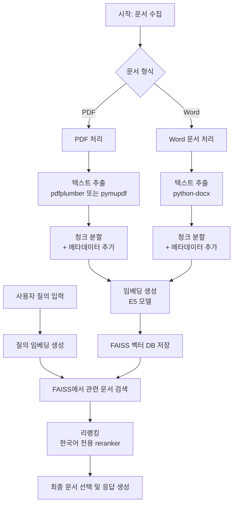

# RAG 실험

이 저장소는 PDF 및 Word 형식의 문서를 처리하고 질의할 수 있는 Retrieval-Augmented Generation (RAG) 시스템 실험을 포함하고 있습니다.

## 프로젝트 개요

이 프로젝트는 다음과 같은 RAG 시스템을 구현합니다:
1. 문서(PDF 및 Word)를 벡터 데이터베이스로 처리
2. 질의에 따라 관련 문서 조각을 검색
3. 한국어 리랭커 모델을 사용하여 검색된 조각을 재정렬
4. 테스트 질문을 통해 검색 성능 평가





문서 처리 방식에 따라 다양한 접근을 실험합니다:
- 기본 모델: 일반적인 PDF 처리 방식
- PDF Fitz 모델: PyMuPDF(fitz)를 사용한 위치 정보 포함 PDF 처리
- Word 모델: Word 문서 처리

## 설치

### 사전 준비
- Python 3.8 이상
- PyTorch

### 설치 방법
1. 이 저장소를 클론하세요.
2. 필요한 패키지를 설치하세요:

```bash
pip install -r requirements.txt
```

### 주요 의존성 패키지
코드에 기반하여 다음 패키지들이 필요합니다:
```
langchain
langchain-community
langchain-huggingface
faiss-cpu
pdfplumber
pymupdf (fitz)
python-docx
transformers
torch
numpy
pandas
seaborn
matplotlib
tqdm
langgraph
```

## 사용 방법

### PDF 문서 처리
기본 모델 또는 PDF Fitz 모델 노트북을 사용하여 PDF 문서를 처리하세요:

```python
from funcs.logic import process_pdfs_to_faiss_with_positions

process_pdfs_to_faiss_with_positions(
    pdf_dir="path/to/pdf/files",
    output_dir="data/output",
    embedding_model_name="intfloat/multilingual-e5-small",
    chunk_size=500,
    chunk_overlap=50
)
```

### Word 문서 처리
Word 모델 노트북을 사용하여 Word 문서를 처리하세요:

```python
from funcs.logic import process_word_documents_to_vector_db

process_word_documents_to_vector_db(
    doc_dir="path/to/word/files",
    output_dir="data/output",
    embedding_model_name="intfloat/multilingual-e5-large-instruct",
    chunk_size=500,
    chunk_overlap=50
)
```

### 문서 질의
검색 파이프라인을 생성하고 문서에 질의하세요:

```python
from langchain.vectorstores import FAISS
from langchain.embeddings import HuggingFaceEmbeddings
from transformers import AutoTokenizer, AutoModelForSequenceClassification
from funcs.logic import get_qa_score
from langgraph.graph import StateGraph
from typing import TypedDict, List, Optional

# 벡터 데이터베이스 로드
vector_db = FAISS.load_local(
    "data/output",
    HuggingFaceEmbeddings(model_name="intfloat/multilingual-e5-small"),
    allow_dangerous_deserialization=True
)

# 리랭커 모델 로드
qa_tokenizer = AutoTokenizer.from_pretrained("Dongjin-kr/ko-reranker")
qa_model = AutoModelForSequenceClassification.from_pretrained("Dongjin-kr/ko-reranker")

# 검색 파이프라인 생성
# ... (전체 구현은 노트북을 참조하세요)
```

## 프로젝트 구조

- **노트북**:
  - `00. base model.ipynb`: PDF 처리 기반 기본 RAG 구현
  - `01. pdf_fitz model.ipynb`: PyMuPDF를 사용한 위치 정보 기반 PDF RAG
  - `02. word model.ipynb`: Word 문서 기반 RAG 구현

- **핵심 기능**:
  - `funcs/logic.py`: 문서 처리, 청크 분할, 임베딩, 검색 등의 핵심 함수 포함

- **데이터**:
  - `data/case1/`: PDF 문서용 벡터 데이터베이스
  - `data/case2/`: Word 문서용 벡터 데이터베이스

## 주요 기능

- 위치 정보 포함 문서 처리
- 메타데이터를 유지한 텍스트 청크 분할
- 다국어 임베딩 (E5 모델 사용)
- 한국어 특화 리랭킹
- 테스트 질문을 통한 검색 성능 평가
- 검색 결과 시각화 기능

## 참고

이 프로젝트는 한국어 문서에 특화되어 있으며, 리랭킹을 위해 한국어 전용 모델을 사용합니다. 코드에는 구현에 대한 추가 설명이 한국어로 주석 처리되어 있습니다.